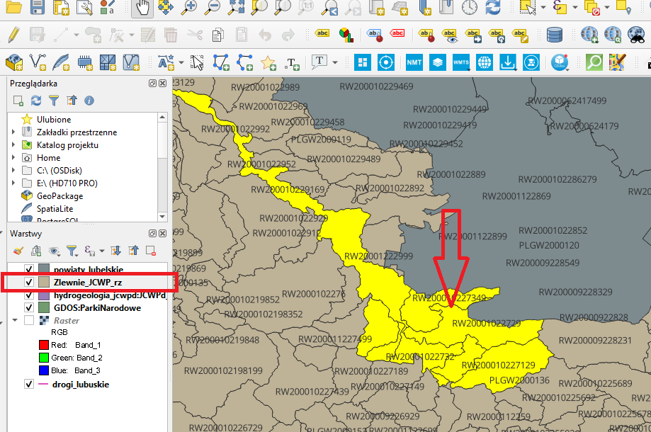
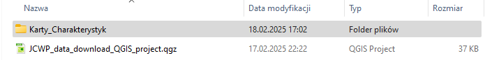

.. CatchmentCollector documentation master file, created by
   sphinx-quickstart on Sun Feb 12 17:11:03 2012.
   You can adapt this file completely to your liking, but it should at least
   contain the root `toctree` directive.

Welcome to Catchment Collector!
===============================

The purpose of the plugin is to download the characteristic cards of selected catchments from the website: `Jednolite czesci wod <http://karty.apgw.gov.pl:4200/informacje>`_ to the folder of a given project.

Using the plugin
================

To use this plugin simply go to the QGIS plugin managerand install it on your system just like any other QGIS plugin.  You will see a toolbutton in the plugins toolbar with the following image.

Before running the plugin, select the layer with the catchments and select the element of interest (you can use the "select by location.." tool in the vector/research tools menu)

After clicking this toolbutton the following dialog will appear

.. image:: images/dialog.png

Choose the layer witch Catchment that you want to use (the previously marked layer with the catchment should already be selected) and the field that defines the code field. 

Click OK and you will see a message dialog similar to the one below with list of downloaded cards.  

.. image:: images/close_message_list.png

The cards will be downloaded to a newly created 'Safety Data Sheets' folder in the project folder.
 

.. toctree::
   :maxdepth: 2

Indices and tables
==================

* :ref:`genindex`
* :ref:`modindex`
* :ref:`search`

